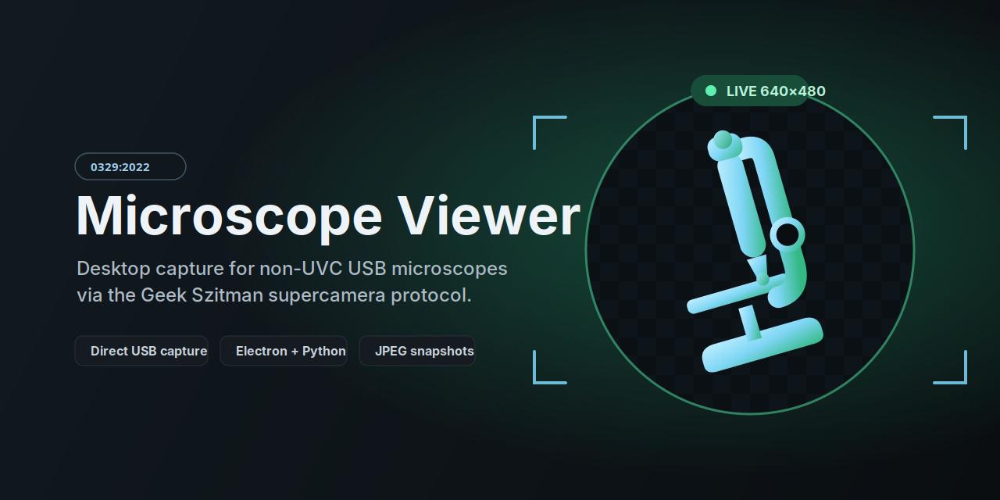

<p align="center">
  
</p>

# Microscope Viewer

Desktop viewer for non-UVC USB microscopes using the Geek Szitman `supercamera` protocol. It was built for the microscope detected as:

```text
0329:2022 Geek szitman supercamera
```

## Features

- Direct USB capture for non-UVC `supercamera` devices.
- Packet-aware frame assembly using the protocol frame ID and declared packet length.
- High-quality desktop preview with device-pixel-ratio rendering, high-quality scaling, and conservative sharpening.
- Preview enhancement can be disabled at runtime; saved snapshots always remain the untouched camera JPEG.
- Electron UI with device refresh, start/stop controls, live image display, FPS/frame counters, and bridge logs.
- udev setup script for user-level USB access.
- Source-only repository with repeatable Node and Python setup.

## Intent

This app exists to make the microscope usable from the desktop without relying on `/dev/video0`. The device is visible on the USB bus, but it does not expose itself as a standard UVC/V4L2 webcam, so Electron's normal `getUserMedia()` path cannot see it.

The app uses Electron for the UI and a small Python/PyUSB bridge for direct USB capture. The bridge understands the packet structure used by `com.useeplus.protocol`, reconstructs complete JPEGs by frame ID, and sends them to Electron as JSON-line events.

## Image quality

The known `0329:2022` / `2ce3:3828` protocol produces JPEG frames that decode to `640 x 480` on tested hardware. The viewer does **not** invent extra sensor detail or re-encode saved photos. Instead it improves the desktop experience in two safe ways:

1. USB packets are assembled according to their declared length and frame ID, avoiding accidental mixing of bytes between adjacent frames on the `0329:2022` variant.
2. The live preview is rendered to a HiDPI canvas with high-quality resampling and a mild sharpening pass. This is preview-only and can be switched back to **Raw** at any time.

The resolution shown in the UI is read from each JPEG's SOF metadata rather than being blindly hard-coded.

## Requirements

- Linux desktop with USB access.
- Node.js and npm.
- Python 3.12 or newer.
- A supported microscope connected over USB:
  - `0329:2022`
  - `2ce3:3828`

## Setup

Install dependencies:

```bash
npm run bootstrap
```

Install the USB permission rule:

```bash
npm run setup:udev
```

Then unplug and reconnect the microscope. If capture still fails with a permission error, log out and back in so the `plugdev` group change is applied.

## Run

```bash
npm start
```

Click `Refresh` if the camera was plugged in after launch, then click `Start`.

Useful checks:

```bash
npm run check:camera
npm test
```

For a direct bridge stream test:

```bash
timeout 10s .venv/bin/python bridge/supercamera_bridge.py stream
```

## Notes

If the device appears in `npm run check:camera` but streaming fails, the most likely causes are USB permissions, a busy/stale USB interface, or a protocol variant not handled by the bridge.

The **Enhanced** preview deliberately uses only a light sharpening amount to improve perceived detail without aggressively exaggerating JPEG ringing. For inspection where exact camera pixels matter, choose **Raw** in the preview-quality menu.

## Documentation

- [Architecture](docs/architecture.md)
- [Troubleshooting](docs/troubleshooting.md)
- [Contributing](CONTRIBUTING.md)
